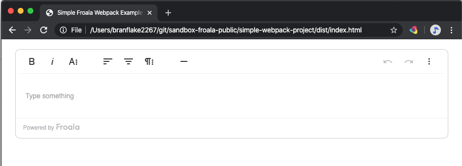

# Simple Froala Webpack Project Example
This covers the basic directions to get up and running with webpack. 

## Configure
If you're creating your webpack configuration from scratch, these plugins will be needed. 

### Webpack

* Run `npm install --save-dev webpack`
* Run `npm install --save-dev webpack webpack-cli`
* Run `npm install --save-dev path`

### Webpack Plugins
The html-webpack-plugin will copy the `index.html` template to the dist folder and add the bundle.js resource to it. 

* Run `npm install --save-dev html-webpack-plugin`
* Run `npm install --save-dev clean-webpack-plugin`
* Run `npm install --save-dev style-loader`
* Run `npm install --save-dev css-loader`

### Froala Editor

* Run `npm install froala-editor`

## Download Dependencies
If you copy or delete the `./node_modules` folder, download the dependencies first.

* Run `npm install`

## Debug
This will run webpack and it observes the changes and will output the changes to the `./dist` directory.

* Run `npm run dev`
* Open the webpack generated file [./dist/index.html](./dist/index.html) in a browser.
